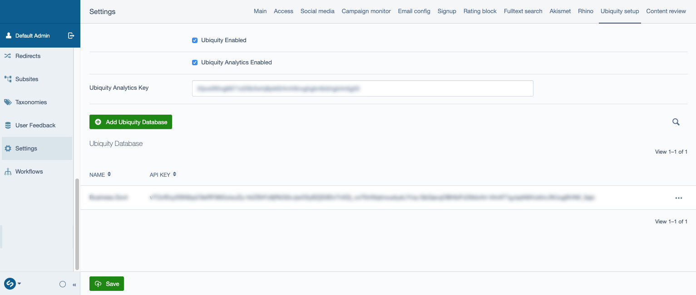
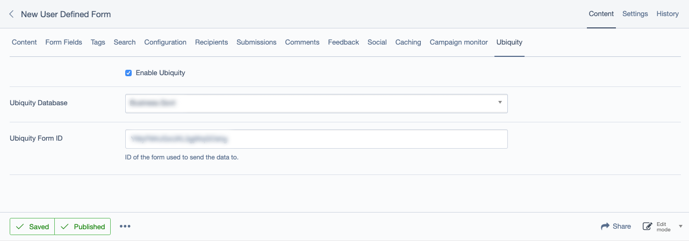
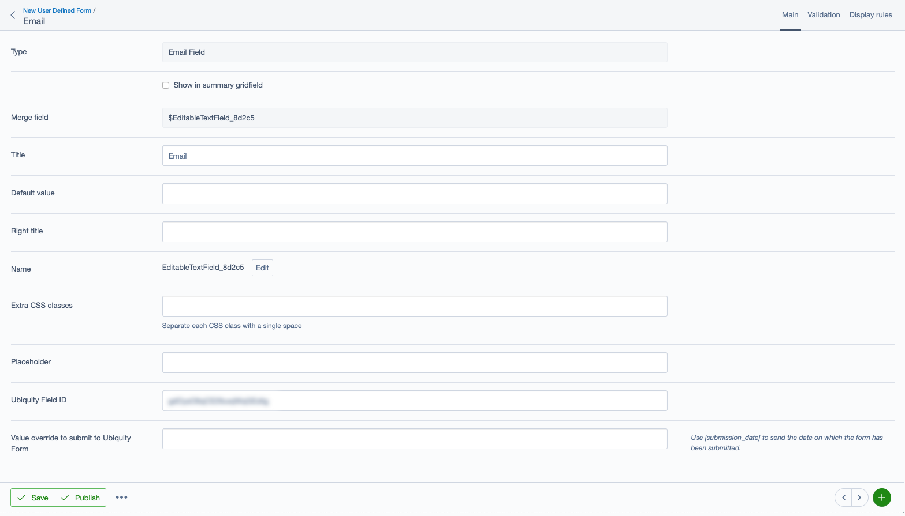

# Ubiquity for Silverstripe - IN DEVELOPMENT

## Introduction

Integrate data with https://www.qrious.co.nz/products/ubiquity

This module integrates with User Defined Forms to provide a way to post data to a Ubiquity form upon submission.

**Note:** This is a new version of the module which requires a Ubiquity form to be created to act as an intermediary between SilverStripe and the Ubiquity database.
The SS3 and dev-SS4 branch can post to the Ubiquity database directly without posting to a Ubiquity form, and would optionally post the form afterward, but this mechanism is flawed and deemed inefficient.

**Note:** Ubiquity offers to create forms that can be customised and embedded into a website. This module requires a Ubiquity form to be created, but will not embed it on the site, but will rather use the API to trigger the form when a UDF is submitted.

## Requirements

```
 "silverstripe/framework": "^4"
 "silverstripe/cms": "^4"
 "silverstripe/userforms": "^5"
```

## Ubiquity requirements

Before you can start populating the Ubiquity database from a SilverStripe form, you need to:

- `Get an API token` from https://engage.ubiquity.co.nz/api/account

- `Create a form` https://engage.ubiquity.co.nz/forms/dashboard/
This form will be used by UDF to post data to a Ubiquity form, which will add/update an entry in the Ubiquity database as well as optionally trigger some extra actions, eg: sending a welcome email.
Add the fields you wish to populate to the form and note their ID.

**Note:** Depending on your level of permission, you may not be able to access these interfaces or create/edit the relevant objects. You may need to contact the account owner to do so or request a `Super User` level of permission.

More documentation can be found at https://help.ubiquity.co.nz/

## Set up

### Global settings

Part of the set up is done in the Settings section of the CMS:

- Create a Ubiquity database in `Settings > Ubiquity setup` and add your API token.
The name of the database doesn't need to match the Ubiquity name, but it is best practice to keep them consistent.

- `Enable Ubiquity` globally. You will later be able to disable it on a per UDF basis.
Note that if you use the Ubiquity service class provided by this module, without using UDF, the global global still applies.

- Optionally `Activate Ubiquity Analytics`. If you have a Analytics key for Ubiquity, a javascript script will be added to UDF pages to provide extra tracking data (similar to Google Analytics).



### User Defined Form

On a User Defined Form page, in the `Ubiquity` tab, you need to:

- `Enable Ubiquity`. Note that if Ubiquity is disabled globally, this config has no effect.

- Select which `Ubiquity Database` you want to use. Databases are essentially an API token that will be used to communicate with Ubiquity. 

- Provide the `Ubiquity form ID` you want to post to. This is required for the process to work. The ID can be found on https://engage.ubiquity.co.nz/api/IdList in the Forms section.
**Note:** the form should be in the same database as previously selected.



#### Form Fields

- Add form fields as you would normally do on a User Defined Form

- If you wish to include the value of a field in the payload sent to Ubiquity, add a `Ubiquity field ID`. These IDs can be found in https://engage.ubiquity.co.nz/api/IdList and optionally in the CMS Settings > Ubiquity setup > Database (edit).
**Note:** Use only the IDs of the fields that have been added to the Ubiquity form.

- Optionally, you can supply a value that will replace the value provided by the user. This is useful in the case of a checkbox, where you want to submit a string other than Yes/No to Ubiquity.
You also have the option to use `[submission_date]` to post the date at which the form has been submitted.



#### Special Fields

This module provides the user with 2 new editable field types:

##### Editable Hidden Field

This field is useful to sent data to Ubiquity without needing a user input, especially if a field is required on the Ubiquity form. Usually a `Source` field or `Date` field is required to track from where and when a user has subscribed.

This field will not be visible on the front end, but will be included in the data sent to ubiquity if a Ubiquity field ID is provided.

Use the `Default Value` field to set the value sent to Ubiquity. You can also use `[submission_date]` to automatically populate the field with the current date.

##### Editable Sign up Field

This is basically a checkbox allowing the user to opt in/out of the sending their data to Ubiquity.

If this field is included on the form, the data will only be submitted to Ubiquity if the user has tick the checkbox.

This field can also sent data to Ubiquity.

##### Editable Multi OptionChoice Field

This field is included out of the box with User Defined Form and is displayed as a Dropdown or Radio boxes.
If a Ubiquity ID is matched to this field, the selected value will be sent to Ubiquity.

In addition, each of its options can have their own Ubiquity field ID. If the option is selected by the user, then a another Ubiquity field can be sent the same value (or the overwritten one). The main application is to record different dates in the database, eg:

Ubiquity database has 3 fields:
- Is subscribed ?
- Opt in date
- Opt out date

The the user defined form has one Multi choice field with 2 options:

- Multi choice field post its value `(Yes or No)` to the "Is Subscribed" field 
- Option 1 (Yes) post the `submission_date]` to the "Opt in date" field
- Option 2 (No) post the `submission_date]` to the "Opt out date" field